# Arquitetura da Informação para App de Banco Digital

**Sistema escolhido**: 

**💵 App de Banco Digital:** Usuários precisam visualizar saldo, pagar boletos, transferir dinheiro e investir, tudo rapidamente e com segurança. O app deve priorizar funções de uso frequente.

Decidi escolher o app de banco digital já que é uma interface que uso diariamente e percebo diversos desafios interessantes relacionados à organização da informação.

## Análise inicial do problema

Os usuários de apps bancários têm objetivos bastante claros quando acessam a plataforma: consultar saldo, fazer transferências, pagar contas e gerenciar investimentos. Diferente de um app de streaming (onde a navegação é mais exploratória), o usuário bancário busca eficiência e segurança acima de tudo.

Analisando o comportamento de busca, percebo que os usuários alternam entre:
- Busca direta (acessar rapidamente funções específicas)
- Verificação de status (saldo, extrato, limites)
- Descoberta de produtos ou serviços (quando o banco sugere investimentos, seguros, etc.)

Observando os bancos que utilizo/tenho conta, consigo perceber abordagens variadas:
- Itaú prioriza a personalização da tela inicial
- Nubank aposta na simplicidade extrema
- BTG foca na experiência de investidor
- C6 Bank equilibra serviços bancários com marketplace

## Modelo de arquitetura proposto

Para atender essas necessidades, proponho uma estrutura híbrida que combina:
- **Base hierárquica**: para organizar categorias de funcionalidades de forma lógica
- **Elementos em malha**: na tela inicial, para acesso rápido às funções mais utilizadas

Esta abordagem mista permite tanto a navegação rápida para tarefas cotidianas quanto a organização lógica de funcionalidades mais complexas ou menos acessadas.

```mermaid
graph TD
    APP[App Banco Digital] --> HOME[Tela Inicial]
    APP --> NAV[Navegação Principal]
    APP --> SEARCH[Sistema de Busca]
    
    %% Estrutura da Tela Inicial
    HOME --> RF[Resumo Financeiro]
    HOME --> AR[Ações Rápidas]
    HOME --> FA[Feed de Atividades]
    
    %% Detalhes do Resumo Financeiro
    RF --> SD[Saldo Disponível]
    RF --> CA[Cartões]
    RF --> RI[Resumo Investimentos]
    
    %% Ações Rápidas (estrutura em malha)
    AR --> PIX[Pix]
    AR --> TR[Transferência]
    AR --> PG[Pagamento]
    AR --> RC[Recarga]
    AR --> CV[Cartão Virtual]
    
    %% Feed de Atividades
    FA --> UT[Últimas Transações]
    FA --> AI[Alertas]
    FA --> OF[Ofertas]
    
    %% Navegação Principal
    NAV --> IN[Início]
    NAV --> PR[Produtos]
    NAV --> TX[Transações]
    NAV --> CT[Cartões]
    NAV --> MN[Menu]
    
    %% Sistema de Busca
    SEARCH --> BG[Busca Global]
    SEARCH --> BF[Busca por Filtros]
    SEARCH --> BR[Busca por Recentes]
    
    %% Produtos (estrutura hierárquica)
    PR --> IV[Investimentos]
    PR --> EM[Empréstimos]
    PR --> SG[Seguros]
    
    %% Transações
    TX --> EX[Extrato]
    TX --> CP[Comprovantes]
    TX --> AG[Agendamentos]
    
    %% Cartões
    CT --> CF[Cartões Físicos]
    CT --> CV2[Cartões Virtuais]
    CT --> FT[Faturas]
    
    %% Menu
    MN --> PF[Perfil]
    MN --> SC[Segurança]
    MN --> AT[Atendimento]
    MN --> AJ[Ajuda]
    MN --> AC[Acessibilidade]
    
    classDef nivel1 fill:#f96,stroke:#333,stroke-width:2px;
    classDef nivel2 fill:#bbf,stroke:#33f,stroke-width:2px;
    classDef nivel3 fill:#ddf,stroke:#33f,stroke-width:1px;
    
    class APP,HOME,NAV,SEARCH nivel1;
    class RF,AR,FA,IN,PR,TX,CT,MN,BG,BF,BR nivel2;
    class SD,CA,RI,PIX,TR,PG,RC,CV,UT,AI,OF,IV,EM,SG,EX,CP,AG,CF,CV2,FT,PF,SC,AT,AJ,AC nivel3;
```

## Detalhamento da arquitetura proposta

### Nível 1: Tela inicial (Home)
Aqui é onde aparece o conceito de malha, com acesso direto às principais funcionalidades:

- **Área superior**: Resumo financeiro
  * Saldo da conta principal (com opção de ocultar)
  * Resumo de cartões (fatura atual e limite disponível)
  * Resumo de investimentos (valor total e rentabilidade)
  
- **Área central**: Ações rápidas
  * Pix (com acesso a favoritos)
  * Transferência
  * Pagamento de contas/boletos
  * Recarga de celular
  * Cartão virtual
  
- **Área inferior**: Feed contextual
  * Últimas transações realizadas
  * Notificações de cobranças pendentes
  * Ofertas personalizadas (baseadas no perfil do usuário)

### Nível 2: Navegação principal
Aplicando o conceito de navegação global (ou como diria o Chico: "Chegar a qualquer tela com 3 cliques"), proporia um menu inferior com:

- Início
- Produtos
- Transações
- Cartões
- Menu expandido

### Nível 3: Estrutura hierárquica para cada seção

- **Produtos**
  * Investimentos (organizados por perfil de risco)
  * Empréstimos (pessoal, veículo, imobiliário)
  * Seguros (vida, residencial, veículo)
  
- **Transações**
  * Extrato (com filtros por período e categoria)
  * Comprovantes (para compartilhamento)
  * Agendamentos (pagamentos futuros)

- **Cartões**
  * Físicos (com visualização de fatura detalhada)
  * Virtuais (gerenciamento de múltiplos cartões)
  * Configurações (limite, bloqueio, ativação internacional)
  
- **Menu expandido**
  * Perfil e configurações
  * Segurança
  * Atendimento
  * Documentos
  * Configurações de notificações
  * Acessibilidade

### Sistema de busca e taxonomia

Inspirado na solução do Banco do Brasil, incluiria um sistema de busca que permite:

- Busca global por transações, produtos e serviços
- Filtros por data, valor e categoria
- Histórico de pesquisas recentes
- Sugestões de busca baseadas no comportamento do usuário

A taxonomia adotará linguagem clara e familiar ao usuário, evitando jargões bancários (experiência própria de ter trabalhado na área de IT Funds no BTG).

## Considerações críticas sobre a experiência

Os pontos mais críticos onde o usuário pode se frustrar são:

1. **Confirmação de transações**: Precisa ser clara e oferecer feedback imediato, porém sem excesso de etapas que tornem o processo demorado.

2. **Navegação entre produtos complexos**: Principalmente na área de investimentos, onde é preciso equilibrar a quantidade de informações técnicas com facilidade de navegação.

3. **Recuperação de erros**: Em casos como pagamentos errados ou problemas de autenticação, o caminho para resolver precisa ser óbvio.

Para minimizar a carga cognitiva, proponho:
- Rótulos claros e consistentes em toda navegação (como faz o Nubank)
- Breadcrumbs nas áreas hierárquicas mais profundas (como dentro de investimentos)
- Botão "voltar" contextual, que não apenas retorna à tela anterior, mas indica para onde o usuário será direcionado

## Feedback e orientação

O feedback constante é essencial em aplicativos bancários devido à natureza sensível das operações. Sugiro:

- Indicadores de progresso em operações (similar ao BTG)
- Confirmações visuais e táteis (vibração) para ações concluídas
- Alertas preventivos quando uma ação pode gerar custos ou consequências importantes

## Balanceando segurança e usabilidade

Um desafio específico de apps bancários é equilibrar segurança com usabilidade. A arquitetura deve prever:

- Biometria para ações sensíveis, sem necessidade de múltiplas senhas
- Diferentes níveis de autenticação baseados no risco da operação (como implementado no Itaú)
- Atalhos para operações frequentes, mas com verificações de segurança adequadas

## Acessibilidade e inclusão

A arquitetura deve pensar em ser acessível aos usuários, contendo:

- Compatibilidade com leitores de tela
- Opção de alto contraste para deficientes visuais (já sofri um pouco como daltônico)
- Comandos por voz para operações básicas
- Textos alternativos para todos elementos visuais
- Ajuste de tamanho de texto sem quebrar o layout

## Conclusão

A arquitetura proposta coloca o usuário no centro do design, equilibrando a necessidade de acesso rápido às funções cotidianas com a segurança e organização lógica necessárias para operações financeiras. A estrutura híbrida (hierárquica com elementos em malha) atende tanto usuários que sabem exatamente o que querem fazer quanto aqueles que precisam explorar opções ou descobrir novos produtos.